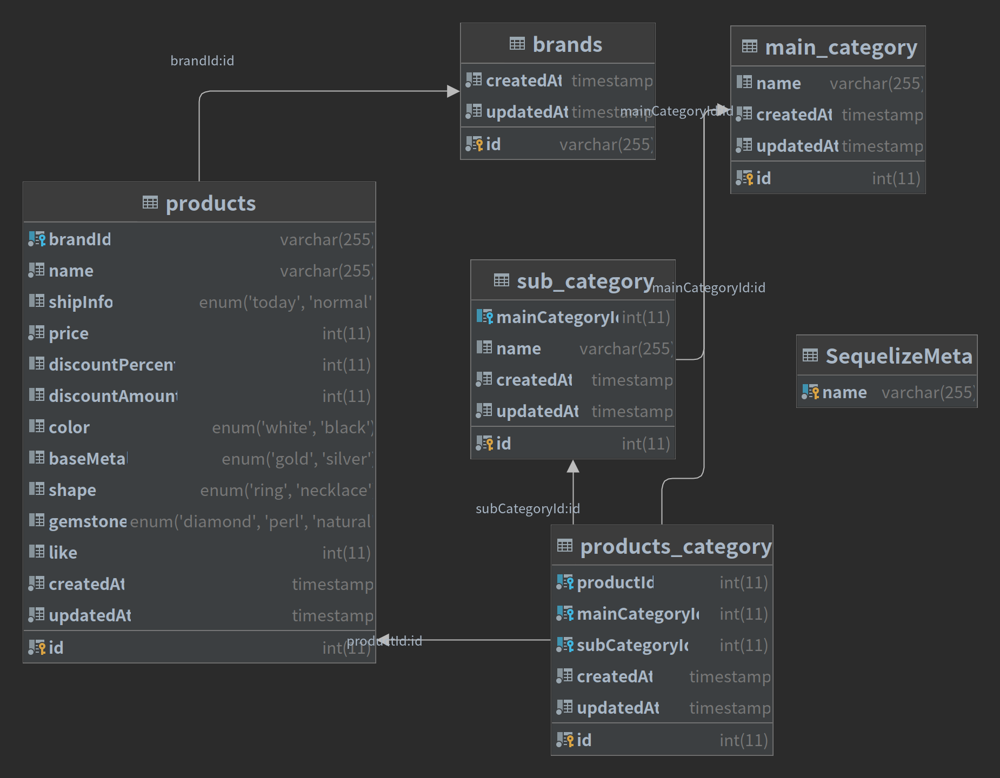

<p align="center">
    <h1 align="center">
        bejewel
    </h1>
    <p align="center">상품에 대한 CRUD API 입니다<a href="https://github.com/dimsssss/bejewel"></a>.</p>
</p>

<p align="center">
    <a href="">
        
    </a>
    <a href="">
        
    </a>
    <a href="">
        
    </a>
    <a href="">
        
    </a>
    <a href="">
        
    </a>
</p>

## 🏗 설치

### 1. 데이터베이스 설치
```shell
docker run --name=bejewel -e MYSQL_ROOT_PASSWORD=1234 -e MYSQL_DATABASE=bejewel -p 6603:3306 -d mysql:5.7
```

### 2. 웹 서버 설치

```shell
git clone https://github.com/dimsssss/bejewel

cd bejewel

npm install
```

### 3. 데이터베이스 마이그레이션
```shell
# migration
npx sequelize-cli db:migrate
```

## 🖼 ERD


## 🌐 API Document
https://documenter.getpostman.com/view/6055091/Uz5CKcoW

## 🧾 실행
```shell
npm run dev
```

## ⚠ 주의 사항
- **brands, category를 먼저 등록**하고 상품을 등록해야 합니다.